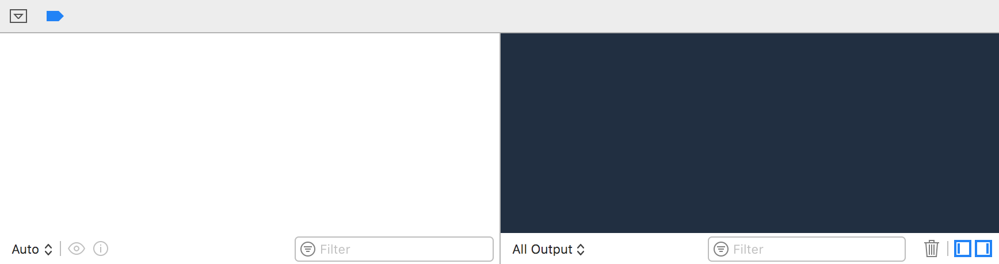
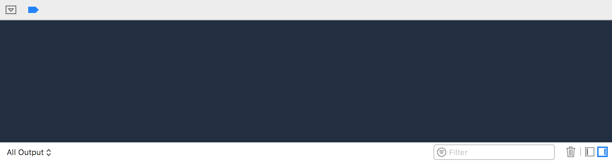

# HideXcodeVariablesView

HideXcodeVariablesView is an "old style" Xcode plugin for defaulting to
showing only the console view, not the variables view, in the debug
area at the bottom of the window.

Before:

After:

## Installation

1. [Un-sign Xcode][unsign]
1. Copy the [latest release][releases] of
   `IgnoreXcodeImageCompletions.xcplugin` to `~/Library/Application
   Support/Developer/Shared/Xcode/Plug-ins`

OR:

1. [Un-sign Xcode][unsign]
1. Clone the repo
1. Run `make install`

### Compatibility

Currently this plugin has been tested with (and has the UUIDs for):

- Xcode 9.2 (9C40b)

[releases]: https://github.com/keith/HideXcodeVariablesView/releases
[unsign]: https://github.com/XVimProject/XVim/blob/master/INSTALL_Xcode8.md
